<div align="center">

```
░██████╗███████╗░█████╗░██╗░░░██╗██████╗░███████╗██╗░░░██╗░█████╗░██╗░░░██╗██╗░░░░░████████╗
██╔════╝██╔════╝██╔══██╗██║░░░██║██╔══██╗██╔════╝██║░░░██║██╔══██╗██║░░░██║██║░░░░░╚══██╔══╝
╚█████╗░█████╗░░██║░░╚═╝██║░░░██║██████╔╝█████╗░░╚██╗░██╔╝███████║██║░░░██║██║░░░░░░░░██║░░░
░╚═══██╗██╔══╝░░██║░░██╗██║░░░██║██╔══██╗██╔══╝░░░╚████╔╝░██╔══██║██║░░░██║██║░░░░░░░░██║░░░
██████╔╝███████╗╚█████╔╝╚██████╔╝██║░░██║███████╗░░╚██╔╝░░██║░░██║╚██████╔╝███████╗░░░██║░░░
╚═════╝░╚══════╝░╚════╝░░╚═════╝░╚═╝░░╚═╝╚══════╝░░░╚═╝░░░╚═╝░░╚═╝░╚═════╝░╚══════╝░░░╚═╝░░░
```

# SECUREVAULT

### Encrypted File Transfer & Secure Storage System


</div>

---

## OVERVIEW

SecureVault is a production-grade encrypted file transfer and storage system built with a zero-knowledge architecture. Files are encrypted entirely on the client side before transmission — the server stores only ciphertext and never has access to passwords or plaintext data.

The system implements AES-256-GCM authenticated encryption, HMAC-SHA256 integrity verification, PBKDF2 key derivation with 600,000 iterations, chunked file processing, resume-capable transfers, and a full REST API — wrapped in a cyber-aesthetic web dashboard and a command-line interface.

> Developed as part of the **Syntecx Internship — Week 4 Project**

---

## OBJECTIVES

- Implement end-to-end AES-256-GCM encrypted file upload and download between client and server
- Split large files into 1MB chunks with per-chunk authentication tags and unique nonces
- Add dual-layer integrity verification using HMAC-SHA256 and SHA-256 blob hashing
- Support resume-capable transfers with checkpoint persistence
- Store all files encrypted at rest — server operates under a zero-knowledge model
- Analyze and document real-world threat vectors including MITM, replay attacks, and storage tampering
- Deliver a full REST API, CLI tool, web dashboard, and a 49-test automated test suite

---

## TOOLS & TECHNOLOGIES

<div align="center">

| | Technology | Role |
|:---:|:---:|:---|
|  | **Python 3** | Core language — crypto engine, server, client, CLI |
|  | **Flask** | Vault server REST API + GUI web app |
|  | **cryptography (OpenSSL)** | AES-256-GCM, PBKDF2, RSA-2048 |
|  | **HTML / CSS / JavaScript** | Cyber-aesthetic frontend dashboard |
|  | **JSON** | Vault metadata and session persistence |
|  | **Windows 11** | Development environment |

</div>

---

## PROJECT STRUCTURE

```
secure_vault/
│
├── core/
│   ├── crypto_engine.py          # AES-256-GCM, HMAC-SHA256, PBKDF2, RSA
│   └── resume_engine.py          # Resumable chunked upload/download
│
├── server/
│   ├── server.py                 # Flask vault server (port 5001)
│   └── session_routes.py         # Chunked upload session API
│
├── client/
│   └── vault_client.py           # Python client library
│
├── templates/
│   └── index.html                # Web dashboard (cyber-aesthetic GUI)
│
├── tests/
│   └── test_all.py               # 49-test automated test suite
│
├── server_storage/               # Encrypted blobs stored here (.svlt)
├── keys/                         # RSA-2048 server key pair
├── downloads/                    # Decrypted output (temp)
│
├── app.py                        # GUI Flask app (port 5000)
├── cli.py                        # Full command-line interface
├── run.py                        # Dual-server launcher
├── requirements.txt
└── README.md
```

---

## IMPLEMENTATION

### Cryptographic Architecture

The system uses **envelope encryption** — a separate random AES-256 key is generated per file and wrapped with a master key derived from the user's password. This means compromising one file's key does not affect any other file.

```
Password
    │
    ▼  PBKDF2-HMAC-SHA256 (600,000 iterations + 32-byte random salt)
Master Key (AES-256)
    │
    ├──► Wraps File Key  (random AES-256)  →  stored encrypted in .svlt header
    └──► Wraps HMAC Key  (random AES-256)  →  stored encrypted in .svlt header
              │                    │
              ▼                    ▼
        Encrypt chunks       MAC entire payload
        (AES-256-GCM)        (HMAC-SHA256)
```

### Encrypted File Format — .svlt

Every encrypted file follows a strict binary layout:

```
┌─────────────────────────────────────────────────────────────┐
│  MAGIC (4B) "SVLT"  │  VERSION (1B)  │  SALT (32B)         │
│  MASTER_NONCE (12B) │  FILE_KEY_ENC (48B)                   │
│  HMAC_KEY_ENC (48B) │  ORIG_SIZE (8B) │  FILENAME (N)       │
│  NUM_CHUNKS (4B)    │  CHUNK_SIZES (4B × N)                 │
│  [ CHUNK_0: NONCE(12) + CIPHERTEXT + GCM_TAG(16) ]         │
│  [ CHUNK_1 ] ··· [ CHUNK_N ]                               │
│  HMAC-SHA256 (32B)  ← seals all bytes above                │
└─────────────────────────────────────────────────────────────┘
```

### Per-Chunk Nonce Construction

```python
nonce (12 bytes) = random(8) || chunk_index_be(4)
aad              = chunk_index_be(4)   # prevents chunk reordering attacks
```

### Resume Support

Each upload creates a `.svlt_checkpoint` file recording which chunks were successfully transmitted. On restart, the client queries the server for received chunks and skips them — resuming exactly where it left off. Downloads use HTTP `Range` headers for byte-level resume.

### Secure Deletion

Files are deleted using a 3-pass overwrite (simplified DoD 5220.22-M) before the file handle is released — making forensic recovery significantly harder.

---

## SCREENSHOTS

<div align="center">

| | |
|:---:|:---:|
| <table><tr><td align="center">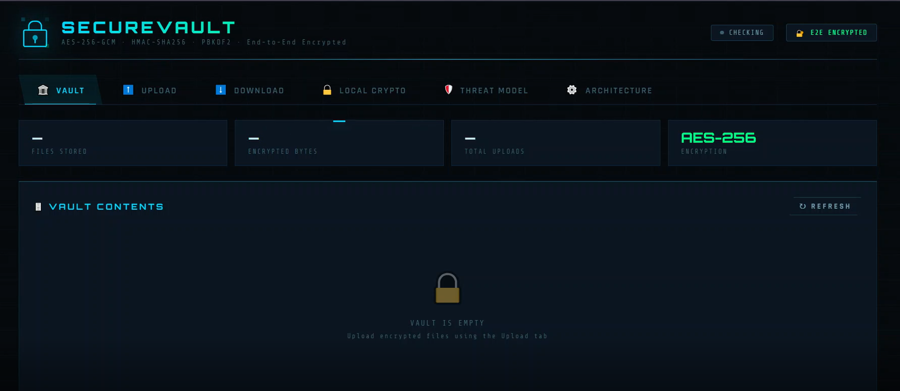<br><sub><b>SecureVault Dashboard</b><br>Main interface showing vault status, server connection, and navigation tabs</sub></td></tr></table> | <table><tr><td align="center">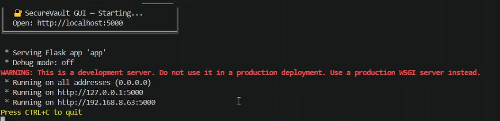<br><sub><b>Servers Running</b><br>Vault server on port 5001 and GUI app on port 5000 both active</sub></td></tr></table> |
| <table><tr><td align="center">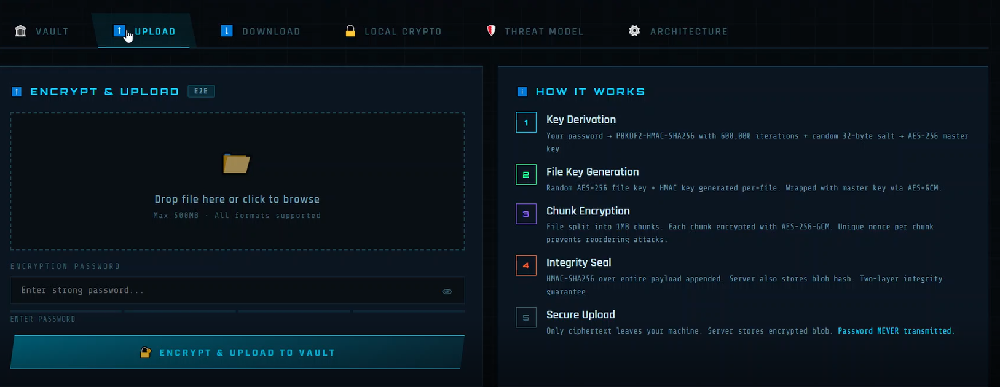<br><sub><b>File Upload</b><br>Drag-and-drop file selection before encryption and upload</sub></td></tr></table> | <table><tr><td align="center">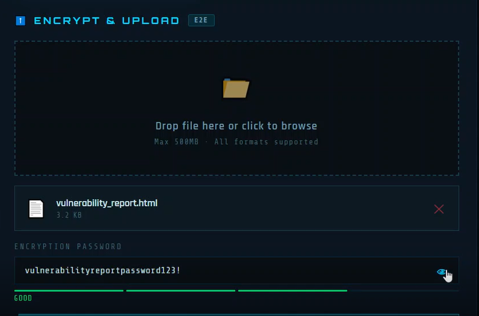<br><sub><b>Encryption Password</b><br>Password entry with strength indicator — never transmitted to server</sub></td></tr></table> |
| <table><tr><td align="center">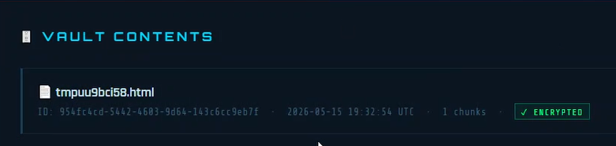<br><sub><b>Vault Contents</b><br>Encrypted file visible in vault with vault ID, chunk count, and integrity badge</sub></td></tr></table> | <table><tr><td align="center">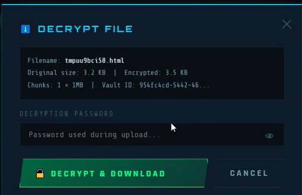<br><sub><b>Decrypt File</b><br>Download modal — HMAC verified before decryption begins</sub></td></tr></table> |
| <table><tr><td align="center">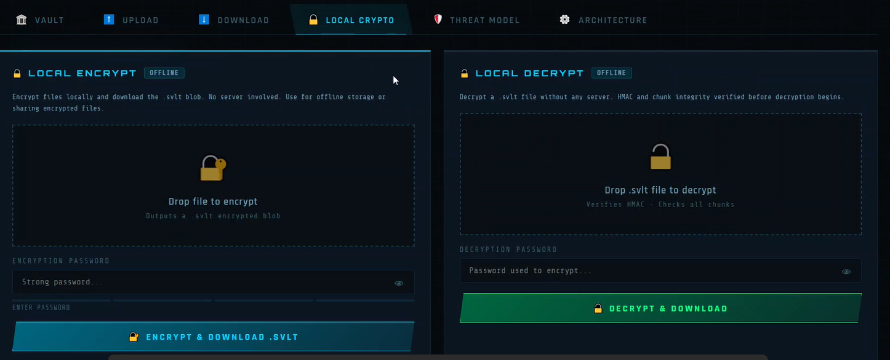<br><sub><b>Local Crypto</b><br>Offline encrypt and decrypt — no server required, full AES-256-GCM applied</sub></td></tr></table> | <table><tr><td align="center">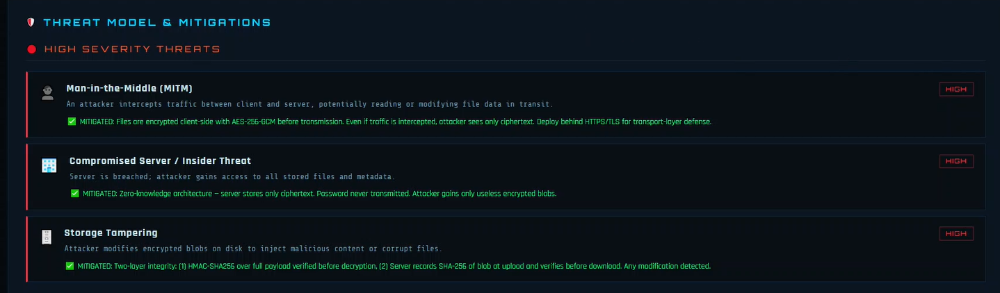<br><sub><b>Threat Model</b><br>Documented attack vectors with severity ratings and mitigations</sub></td></tr></table> |
| <table><tr><td align="center">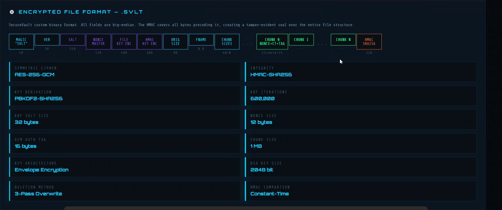<br><sub><b>Encrypted File Format</b><br>.svlt binary layout — magic bytes, key material, chunks, and HMAC seal</sub></td></tr></table> | <table><tr><td align="center">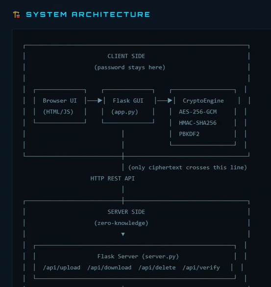<br><sub><b>System Architecture</b><br>Client-server separation — only ciphertext crosses the network boundary</sub></td></tr></table> |
| <table><tr><td align="center">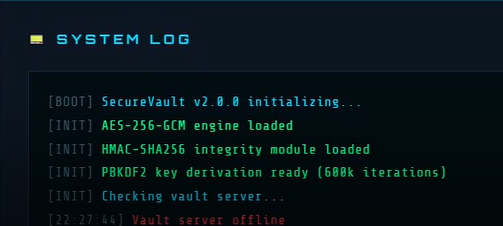<br><sub><b>System Log</b><br>Live terminal log showing AES engine, HMAC module, and server activity</sub></td></tr></table> | |

</div>

---

## COMMANDS & USAGE

**Install dependencies**
```bash
pip install -r requirements.txt
```

**Start both servers**
```bash
# Terminal 1 — Vault Server
cd secure_vault
python -m server.server

# Terminal 2 — GUI App
cd secure_vault
python app.py
```

**Open the dashboard**
```
http://localhost:5000
```

**CLI — Encrypt a file locally**
```bash
python cli.py encrypt myfile.pdf --password "MySecurePass"
```

**CLI — Upload to vault**
```bash
python cli.py upload myfile.pdf --server http://localhost:5001
```

**CLI — List vault contents**
```bash
python cli.py list
```

**CLI — Download and decrypt**
```bash
python cli.py download <vault-id> --output ./downloads
```

**CLI — Verify file integrity**
```bash
python cli.py verify <vault-id>
```

**CLI — Secure delete**
```bash
python cli.py delete <vault-id>
```

**CLI — Inspect a .svlt file without decrypting**
```bash
python cli.py info myfile.pdf.svlt
```

**Run the full test suite**
```bash
python tests/test_all.py
```

---

## THREAT MODEL

| Threat | Severity | Mitigation |
|:---|:---:|:---|
| Man-in-the-Middle (MITM) | `HIGH` | E2E encryption — only ciphertext transmitted; deploy with HTTPS in production |
| Compromised Server / Insider | `HIGH` | Zero-knowledge — password never sent; server stores only encrypted blobs |
| Storage Tampering | `HIGH` | HMAC-SHA256 over full payload + SHA-256 blob hash verified before download |
| Replay / Chunk Reordering | `MEDIUM` | Per-chunk unique nonce + chunk index as GCM Additional Authenticated Data |
| Weak Password / Brute Force | `MEDIUM` | PBKDF2-SHA256 with 600,000 iterations + 32-byte random salt |
| Timing Attack on HMAC | `MEDIUM` | `hmac.compare_digest()` — constant-time comparison |
| Nonce Reuse (AES-GCM) | `MEDIUM` | Per-file random key generation; nonce = random(8) + counter(4) |
| Plaintext in Temp Files | `LOW` | `os.urandom()` overwrite before deletion in all code paths |
| Data Recovery After Delete | `LOW` | 3-pass overwrite before file unlink (DoD 5220.22-M simplified) |
| Padding Oracle | `LOW` | GCM mode has no padding; authenticate-then-decrypt order enforced |

---

## CRYPTOGRAPHIC SPECIFICATIONS

| Parameter | Value |
|:---|:---|
| Symmetric Cipher | AES-256-GCM |
| Key Size | 256 bits |
| Nonce Size | 12 bytes (96-bit) |
| GCM Authentication Tag | 16 bytes (128-bit) |
| Integrity MAC | HMAC-SHA256 |
| Key Derivation Function | PBKDF2-HMAC-SHA256 |
| KDF Iterations | 600,000 (NIST SP 800-132) |
| KDF Salt | 32 bytes (random per encryption) |
| Key Architecture | Envelope Encryption |
| Server Key Pair | RSA-2048 |
| Chunk Size | 1 MB |
| Deletion Method | 3-Pass Overwrite |
| HMAC Comparison | Constant-Time (`hmac.compare_digest`) |

---

## TEST RESULTS

```
Ran 49 tests in 8.205s

════════════════════════════════════════════════════════════
  Tests run:    49
  Failures:     0
  Errors:       0
  Skipped:      0
  Status:       ALL PASSED
════════════════════════════════════════════════════════════
```

Test coverage includes: cryptographic primitives, file encryptor roundtrips, security property enforcement (authenticate-then-decrypt ordering, chunk reordering detection, constant-time HMAC), REST API endpoints, Range-request resume downloads, RSA key management, concurrent operations, and throughput benchmarks.

---

## CONCLUSION

SecureVault demonstrates that a zero-knowledge encrypted storage system can be built with clean architecture, real cryptographic rigor, and a production-ready interface. Every layer of the system — from key derivation to chunk authentication to secure deletion — was designed around concrete threat vectors rather than checkbox security.

Key achievements include implementing envelope encryption with per-file random keys, enforcing authenticate-then-decrypt order to prevent oracle attacks, building resume-capable chunked transfers with checkpoint persistence, and delivering a full test suite that validates security properties programmatically rather than by assumption.

The core takeaway is that security is architectural — it is not enough to encrypt data in isolation. Every component, from how passwords are handled to how files are deleted, must be considered part of the attack surface.

---

<div align="center">

Developed as part of the **Syntecx Internship — Week 4**<br>
Encrypted File Transfer & Secure File Storage System

</div>
